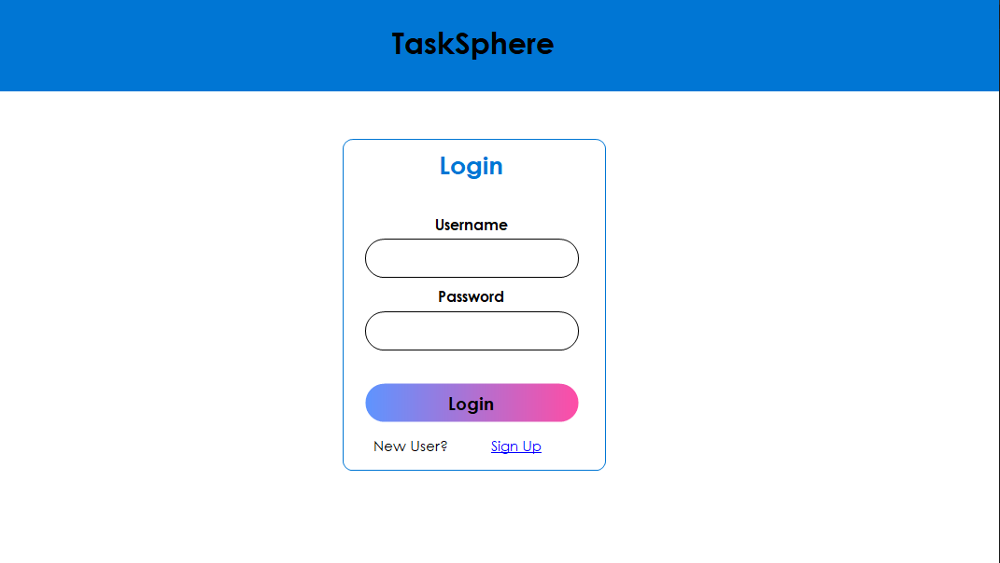
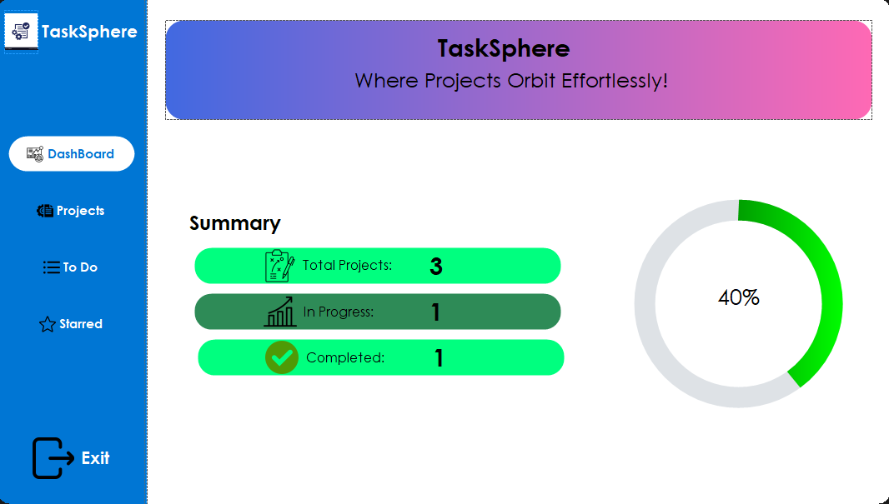
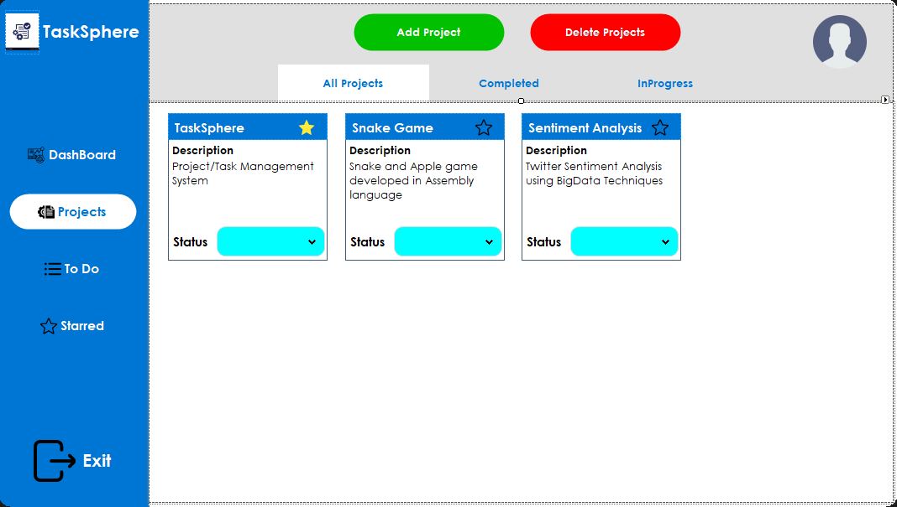
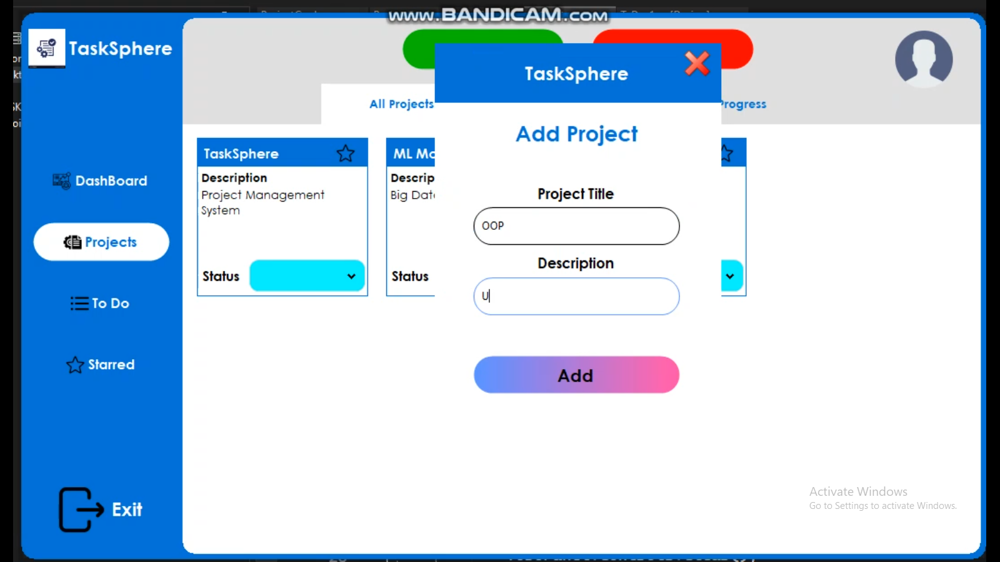

# TaskSphere: Optimizing Task Lifecycles via Relational Frameworks (Task Management System)

## Introduction

TaskSphere is a Windows Forms task management application built with C# and .NET Framework. It stores data locally in the user's AppData folder, so it can run without SQL Server. With TaskSphere, you can sign up, log in, create tasks, search projects, update statuses, star important tasks, edit/delete projects, and review activity in a timeline.

## Graphical User Interface 

<div align="center">
  
  
  
  
  
</div>


## Technologies Used

- C#
- .NET Framework
- Windows Forms
- Local XML storage in `%AppData%\TaskSphere`
- GUNA.UI2 package

## Features

- Create tasks from Projects, To Do, or Timeline
- Search projects by title or description
- Edit and delete projects directly from project cards
- Set task statuses (To Do/InProgress/Completed)
- Mark tasks as important
- View starred tasks
- View a Timeline of recent project activity
- Dashboard for task overview

## Getting Started

### Prerequisites

- Windows OS
- Visual Studio
- .NET Framework 4.7.2 targeting pack recommended

### Installation

1. **Clone the repository:**
    ```bash
    git clone https://github.com/burhanahmed1/Task-Management-System.git
    ```

2. **Open the solution file:**
    - Open `TaskSphere.sln` in Visual Studio.

3. **Local storage:**
    - No SQL Server setup is required.
    - The app creates `%AppData%\TaskSphere\TaskSphereData.xml` automatically.
    - Backups are saved as `TaskSphereData.backup.xml`.

4. **Build and run the application:**
    - Build the solution in Visual Studio.
    - Run the application.

### Usage

1. **Login/SignUp**
    - For a new user SignUp is compulsory, after SignUp user's data will be stored in the database and for his next visits he/she just Login to enter the app.

2. **Creating Tasks:**
    - Open the application and navigate to the task creation section.
    - Enter task details and save.

3. **Managing To-Do Lists:**
    - Create new lists, add tasks to them, and organize as needed.

4. **Setting Task Status:**
    - Update the status of tasks to `To Do`, `InProgress`, or `Completed` from project cards or Timeline.

5. **Marking Important Tasks:**
    - Star tasks to mark them as important for quick access.

6. **Deleting Tasks:**
    - Remove tasks from your list by selecting the delete option.

7. **Dashboard Overview:**
    - Use the dashboard to get a quick overview of all tasks, their statuses, and important tasks.

8. **Timeline:**
    - Open Timeline to see recent project activity.
    - Add, edit, delete, or change project status from the Timeline page.
  
9. **Exit/Close App:**
    - Click on the Exit icon in the bottom of the main left panel.

## Developer Notes

- `Helpers/DBHelper.cs` is the local data layer. It handles XML persistence, password hashing, project CRUD, status movement, and timeline activity logging.
- `Pages/Timeline.cs` is code-built rather than designer-built. Its helper methods create the page header, quick-add form, timeline rows, edit dialog, and row actions.
- Timeline activity is capped to the latest 200 events to keep the local data file small.

## Contributing

Contributions are welcome! Please fork the repository and create a pull request with your changes.

## License

This project is licensed under the MIT License.

## Acknowledgements

Inspiration for this project came from the need for efficient task management tools.
